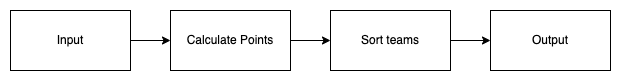
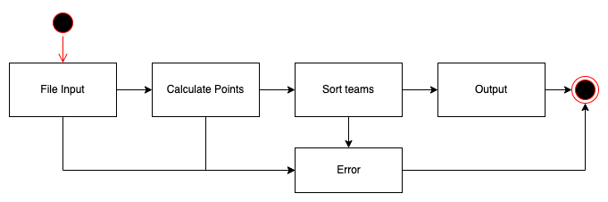

# League Ranking cli application



Production ready, maintainable, testable command-line application that will calculate the ranking table for a league.
This simple cli application takes a text file contain a list of match results as input, calculates points for each team and prints a ranking table for a league.

[BE Coding Test - Candidate.pdf](BE&#32;Coding&#32;Test&#32;-&#32;Candidate.pdf) contains the entire brief about the problem.

## System design



- A state machine as described in the diagram above will controll the logical flow of the application and define a clear scope for our unit tests.
- Unit tests will ensure each unit of logical processing/computation behaves as intended and is written in a clear manner that directly addresses the concerns of the unit.
- Unit test also promotes writing minimal, maintainable and testable code and cuts out all of the unnecessary.

## Roadmap / Tasks
- [X] Create a state machine
- [X] Set up a unit testing environment.
- [X] Unit test the state machine to validate our state transitions
- [ ] Write unit tests for operations/computation within each state/stage in our system
- [ ] Program solutions that pass when for Unit tests
- [ ] Review - refactor and update README. The submit the assessment.

## Installation
Ensure you have nodejs installed then simply run:
```
npm i
```

## Usage
```
node . [file path]
```

## Testing
Run Tests once:
```
npm test
```

Rerun tests after file changes:
```
npm run tdd
```